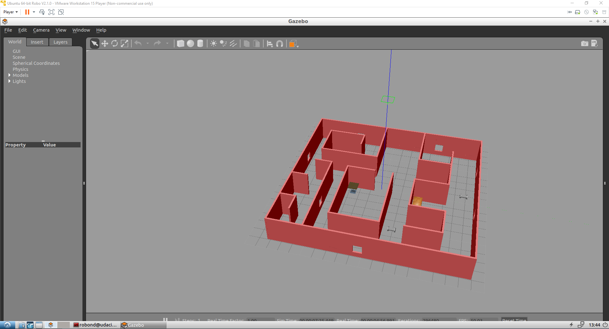

# RoboND-Build-My-World-P1
 The purpose of this project is to design a world  with the Model Editor tool &  Building Editor tool in Gazebo. Include this model in an empty Gazebo World. And, finally write a plugin to interact with this world.  

### Directory Structure
```
    .Project                           # RoboND Project1: Build My World 
    ├── images                         # Code output image                   
    │   ├── world.png
    ├── model                          # Model files of the two-wheeled robot
    │   ├── Building
    │   │   ├── model.config
    │   │   ├── model.sdf
    │   ├── myrobot
    │   │   ├── model.config
    │   │   ├── model.sdf
    ├── script                         # Gazebo World plugin C++ script      
    │   ├── welcome.cpp
    ├── world                          # Gazebo main World empty scene
    │   ├── myworld
    ├── CMakeLists.txt                 # Link libraries 
    └──                              
```

### Steps to launch the simulation

#### Step 1 Update and upgrade the Workspace image
```sh
$ sudo apt-get update
$ sudo apt-get upgrade -y
```

#### Step 2 Clone the lab folder in /home/workspace/
```sh
$ cd /home/workspace/
$ git clone https://github.com/udacity/RoboND-myrobot myrobot
```

#### Step 3 Compile the code
```sh
$ cd ~/workspace/myrobot/
$ mkdir build
$ cd build/
$ cmake ../
$ make
```

#### Step 4 Add the library path to the Gazebo plugin path  
```sh
$ export GAZEBO_PLUGIN_PATH=${GAZEBO_PLUGIN_PATH}:~/Project/build
```
(For my case: export GAZEBO_PLUGIN_PATH=${GAZEBO_PLUGIN_PATH}:/home/robond/Desktop/workspace/[RoboND-Build-My-World-P1](https://github.com/umtclskn/RoboND-Build-My-World-P1)/build)

#### Step 5 Run the Gazebo World file  
```sh
$ cd /home/robond/Desktop/workspace/RoboND-Build-My-World-P1/world
$ gazebo myworld
```

### Output
The hello world message and the two-wheeled robot inside a Gazebo World should both launch as follow: 
